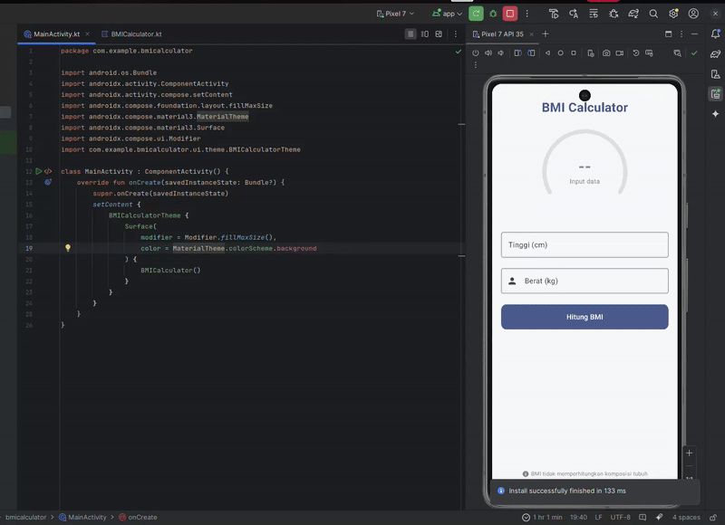

# Body Mass Calculator

`MainActivyty.kt`:

```kt
package com.example.bmicalculator

import android.os.Bundle
import androidx.activity.ComponentActivity
import androidx.activity.compose.setContent
import androidx.compose.foundation.layout.fillMaxSize
import androidx.compose.material3.MaterialTheme
import androidx.compose.material3.Surface
import androidx.compose.ui.Modifier
import com.example.bmicalculator.ui.theme.BMICalculatorTheme

class MainActivity : ComponentActivity() {
    override fun onCreate(savedInstanceState: Bundle?) {
        super.onCreate(savedInstanceState)
        setContent {
            BMICalculatorTheme {
                Surface(
                    modifier = Modifier.fillMaxSize(),
                    color = MaterialTheme.colorScheme.background
                ) {
                    BMICalculator()
                }
            }
        }
    }
}
```

`BMICalculator.kt`:

- Adding visual categorization system showing different colors for underweight (blue), normal (green), overweight (yellow), and obese (red) states.
- Adding interactive gauge with color-coded animation that represents the calculated BMI value.

```kt
package com.example.bmicalculator

import androidx.compose.animation.animateColorAsState
import androidx.compose.animation.core.animateFloatAsState
import androidx.compose.animation.core.tween
import androidx.compose.foundation.Canvas
import androidx.compose.foundation.background
import androidx.compose.foundation.layout.*
import androidx.compose.foundation.shape.CircleShape
import androidx.compose.foundation.shape.RoundedCornerShape
import androidx.compose.foundation.text.KeyboardOptions
import androidx.compose.material.icons.Icons
import androidx.compose.material.icons.filled.Info
import androidx.compose.material.icons.filled.Person
import androidx.compose.material3.*
import androidx.compose.runtime.*
import androidx.compose.ui.Alignment
import androidx.compose.ui.Modifier
import androidx.compose.ui.draw.clip
import androidx.compose.ui.geometry.Offset
import androidx.compose.ui.geometry.Size
import androidx.compose.ui.graphics.Color
import androidx.compose.ui.graphics.StrokeCap
import androidx.compose.ui.graphics.drawscope.Stroke
import androidx.compose.ui.text.font.FontWeight
import androidx.compose.ui.text.input.KeyboardType
import androidx.compose.ui.text.style.TextAlign
import androidx.compose.ui.unit.dp
import androidx.compose.ui.unit.sp
import kotlin.math.pow

@Composable
fun BMICalculator() {
    var height by remember { mutableStateOf("") }
    var weight by remember { mutableStateOf("") }
    var bmi by remember { mutableStateOf(0f) }
    var bmiCategory by remember { mutableStateOf("") }
    var bmiDescription by remember { mutableStateOf("") }
    var isCalculated by remember { mutableStateOf(false) }

    val bmiColor by animateColorAsState(
        targetValue = when {
            bmi < 18.5f -> Color(0xFF64B5F6) // Underweight -> Light Blue
            bmi in 18.5f..24.9f -> Color(0xFF81C784) // Normal Weight -> Green
            bmi in 25f..29.9f -> Color(0xFFFFD54F) // Overweight -> Yellow
            else -> Color(0xFFE57373) // Obese - Red
        },
        animationSpec = tween(500)
    )

    val progress by animateFloatAsState(
        targetValue = if (isCalculated) {
            when {
                bmi > 40f -> 1f
                else -> bmi / 40f
            }
        } else 0f,
        animationSpec = tween(1000)
    )

    Column(
        modifier = Modifier
            .fillMaxSize()
            .padding(20.dp),
        horizontalAlignment = Alignment.CenterHorizontally
    ) {
        Text(
            text = "BMI Calculator",
            fontWeight = FontWeight.Bold,
            fontSize = 28.sp,
            color = MaterialTheme.colorScheme.primary,
            modifier = Modifier.padding(vertical = 16.dp)
        )

        // Gauge
        Box(
            contentAlignment = Alignment.Center,
            modifier = Modifier
                .size(220.dp)
                .padding(20.dp)
        ) {
            Canvas(modifier = Modifier.size(180.dp)) {
                // Background circle
                drawArc(
                    color = Color(0xFFE0E0E0),
                    startAngle = 150f,
                    sweepAngle = 240f,
                    useCenter = false,
                    style = Stroke(width = 24f, cap = StrokeCap.Round)
                )

                // Progress arc
                if (isCalculated) {
                    drawArc(
                        color = bmiColor,
                        startAngle = 150f,
                        sweepAngle = 240f * progress,
                        useCenter = false,
                        style = Stroke(width = 24f, cap = StrokeCap.Round)
                    )
                }
            }

            Column(
                horizontalAlignment = Alignment.CenterHorizontally,
                verticalArrangement = Arrangement.Center
            ) {
                Text(
                    text = if (isCalculated) String.format("%.1f", bmi) else "--",
                    fontSize = 36.sp,
                    fontWeight = FontWeight.Bold,
                    color = if (isCalculated) bmiColor else Color.Gray
                )
                Text(
                    text = if (isCalculated) "BMI" else "Input data",
                    fontSize = 14.sp,
                    color = Color.Gray
                )
            }
        }

        // Category display
        if (isCalculated) {
            Box(
                modifier = Modifier
                    .fillMaxWidth()
                    .padding(vertical = 8.dp)
                    .clip(RoundedCornerShape(8.dp))
                    .background(bmiColor.copy(alpha = 0.2f))
                    .padding(16.dp),
                contentAlignment = Alignment.Center
            ) {
                Column(horizontalAlignment = Alignment.CenterHorizontally) {
                    Text(
                        text = bmiCategory,
                        fontWeight = FontWeight.Bold,
                        fontSize = 18.sp,
                        color = bmiColor
                    )
                    Text(
                        text = bmiDescription,
                        textAlign = TextAlign.Center,
                        color = Color.DarkGray,
                        fontSize = 14.sp,
                        modifier = Modifier.padding(top = 4.dp)
                    )
                }
            }
        }

        Spacer(modifier = Modifier.height(16.dp))

        // Input fields
        OutlinedTextField(
            value = height,
            onValueChange = { height = it },
            label = { Text("Tinggi (cm)") },
            singleLine = true,
            keyboardOptions = KeyboardOptions(keyboardType = KeyboardType.Number),
            // Menghapus leadingIcon untuk menghindari error
            modifier = Modifier.fillMaxWidth()
        )

        Spacer(modifier = Modifier.height(16.dp))

        OutlinedTextField(
            value = weight,
            onValueChange = { weight = it },
            label = { Text("Berat (kg)") },
            singleLine = true,
            keyboardOptions = KeyboardOptions(keyboardType = KeyboardType.Number),
            leadingIcon = {
                Icon(imageVector = Icons.Default.Person, contentDescription = "Weight")
            },
            modifier = Modifier.fillMaxWidth()
        )

        Spacer(modifier = Modifier.height(24.dp))

        // Calculate button
        Button(
            onClick = {
                if (height.isNotEmpty() && weight.isNotEmpty()) {
                    val heightInMeters = height.toFloat() / 100
                    val weightInKg = weight.toFloat()
                    bmi = weightInKg / (heightInMeters.pow(2))

                    bmiCategory = when {
                        bmi < 18.5f -> "Kekurangan Berat Badan"
                        bmi in 18.5f..24.9f -> "Berat Badan Normal"
                        bmi in 25f..29.9f -> "Kelebihan Berat Badan"
                        else -> "Obesitas"
                    }

                    bmiDescription = when {
                        bmi < 18.5f -> "Anda perlu menambah berat badan dengan mengonsumsi makanan bergizi."
                        bmi in 18.5f..24.9f -> "Berat badan Anda ideal. Pertahankan pola makan dan gaya hidup sehat Anda!"
                        bmi in 25f..29.9f -> "Anda sedikit di atas berat badan ideal. Pertimbangkan untuk lebih banyak olahraga."
                        else -> "Anda perlu menurunkan berat badan untuk kesehatan yang lebih baik."
                    }

                    isCalculated = true
                }
            },
            modifier = Modifier
                .fillMaxWidth()
                .height(56.dp),
            shape = RoundedCornerShape(12.dp)
        ) {
            Text("Hitung BMI", fontSize = 16.sp)
        }

        Spacer(modifier = Modifier.height(24.dp))

        // BMI Categories info
        if (isCalculated) {
            Row(
                modifier = Modifier.fillMaxWidth(),
                horizontalArrangement = Arrangement.SpaceBetween
            ) {
                CategoryIndicator(
                    category = "Kurang",
                    color = Color(0xFF64B5F6),
                    range = "<18.5"
                )
                CategoryIndicator(
                    category = "Normal",
                    color = Color(0xFF81C784),
                    range = "18.5-24.9"
                )
                CategoryIndicator(
                    category = "Lebih",
                    color = Color(0xFFFFD54F),
                    range = "25-29.9"
                )
                CategoryIndicator(
                    category = "Obesitas",
                    color = Color(0xFFE57373),
                    range = ">30"
                )
            }
        }

        Spacer(modifier = Modifier.weight(1f))

        // Info text
        Row(
            verticalAlignment = Alignment.CenterVertically,
            modifier = Modifier.padding(bottom = 16.dp)
        ) {
            Icon(
                imageVector = Icons.Default.Info,
                contentDescription = "Info",
                tint = Color.Gray,
                modifier = Modifier.size(16.dp)
            )
            Spacer(modifier = Modifier.width(4.dp))
            Text(
                text = "BMI tidak memperhitungkan komposisi tubuh",
                fontSize = 12.sp,
                color = Color.Gray
            )
        }
    }
}

@Composable
fun CategoryIndicator(
    category: String,
    color: Color,
    range: String
) {
    Column(
        horizontalAlignment = Alignment.CenterHorizontally,
        modifier = Modifier.padding(4.dp)
    ) {
        Box(
            modifier = Modifier
                .size(12.dp)
                .clip(CircleShape)
                .background(color)
        )
        Text(
            text = category,
            fontSize = 10.sp,
            color = Color.DarkGray,
            modifier = Modifier.padding(top = 2.dp)
        )
        Text(
            text = range,
            fontSize = 9.sp,
            color = Color.Gray
        )
    }
}
```

Result:



> Reference: [medium.com](https://medium.com/@shivamkadam0709/how-to-make-a-bmi-calculator-in-jetpack-compose-7be33bf87f90)
