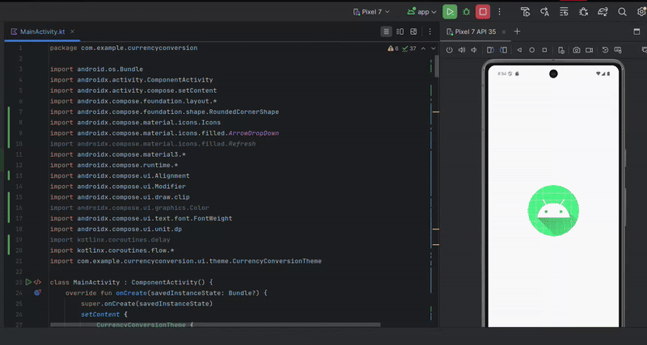

# Currency Converter

A simple Android currency conversion app built with Jetpack Compose.

- Convert between 10 world currencies (IDR, USD, EUR, JPY, SGD, AUD, GBP, CHF, CAD, CNY)

- Based on IDR (Indonesian Rupiah):

    USD: 16,823

    EUR: 19,150

    JPY: 117.06

    SGD: 12,570

    AUD: 11,350

    GBP: 22,450

    CHF: 19,750

    CAD: 12,400

    CNY: 2,418

## Modifications

`MainActivity.kt`:

```kt
package com.example.currencyconversion

import android.os.Bundle
import androidx.activity.ComponentActivity
import androidx.activity.compose.setContent
import androidx.compose.foundation.layout.*
import androidx.compose.foundation.shape.RoundedCornerShape
import androidx.compose.material.icons.Icons
import androidx.compose.material.icons.filled.ArrowDropDown
import androidx.compose.material.icons.filled.Refresh
import androidx.compose.material3.*
import androidx.compose.runtime.*
import androidx.compose.ui.Alignment
import androidx.compose.ui.Modifier
import androidx.compose.ui.draw.clip
import androidx.compose.ui.graphics.Color
import androidx.compose.ui.text.font.FontWeight
import androidx.compose.ui.unit.dp
import kotlinx.coroutines.delay
import kotlinx.coroutines.flow.*
import com.example.currencyconversion.ui.theme.CurrencyConversionTheme

class MainActivity : ComponentActivity() {
    override fun onCreate(savedInstanceState: Bundle?) {
        super.onCreate(savedInstanceState)
        setContent {
            CurrencyConversionTheme {
                Surface(modifier = Modifier.fillMaxSize()) {
                    CurrencyConverter()
                }
            }
        }
    }
}

// Pindahkan data kurs ke bagian data statis
private val EXCHANGE_RATES = mapOf(
    "IDR" to 1.0,
    "USD" to 16823.0,
    "EUR" to 19150.0,
    "JPY" to 117.06,
    "SGD" to 12570.0,
    "AUD" to 11350.0,
    "GBP" to 22450.0,
    "CHF" to 19750.0,
    "CAD" to 12400.0,
    "CNY" to 2418.0
)

@Composable
fun CurrencyConverter() {
    val currencies = remember { listOf("IDR", "USD", "EUR", "JPY", "SGD", "AUD", "GBP", "CHF", "CAD", "CNY") }
    var amountInput by remember { mutableStateOf("") }
    var fromCurrency by remember { mutableStateOf("IDR") }
    var toCurrency by remember { mutableStateOf("USD") }

    // Warna tema
    val primaryColor = MaterialTheme.colorScheme.primary
    val surfaceColor = MaterialTheme.colorScheme.surfaceVariant

    // Menggunakan debounce untuk mengurangi perhitungan berulang
    val debouncedAmountFlow = remember {
        MutableStateFlow("")
    }
    val debouncedAmount by produceState("") {
        debouncedAmountFlow
            .debounce(300)
            .collect { value = it }
    }

    // Update flow saat input berubah
    LaunchedEffect(amountInput) {
        debouncedAmountFlow.value = amountInput
    }

    // Menyimpan hasil konversi dengan remember untuk mengurangi perhitungan berulang
    val convertedAmount by remember(debouncedAmount, fromCurrency, toCurrency) {
        derivedStateOf {
            val amount = debouncedAmount.toDoubleOrNull() ?: 0.0
            convertCurrency(amount, fromCurrency, toCurrency)
        }
    }

    Column(
        modifier = Modifier
            .fillMaxSize()
            .padding(16.dp),
        verticalArrangement = Arrangement.spacedBy(16.dp)
    ) {
        Card(
            modifier = Modifier.fillMaxWidth(),
            elevation = CardDefaults.cardElevation(defaultElevation = 2.dp)
        ) {
            Column(
                modifier = Modifier.padding(16.dp),
                horizontalAlignment = Alignment.CenterHorizontally
            ) {
                Text(
                    "Currency Converter",
                    style = MaterialTheme.typography.headlineMedium,
                    fontWeight = FontWeight.Bold
                )
                Spacer(modifier = Modifier.height(4.dp))
                Text(
                    "Convert between world currencies",
                    style = MaterialTheme.typography.bodyMedium,
                    color = MaterialTheme.colorScheme.onSurfaceVariant
                )
            }
        }

        Spacer(modifier = Modifier.height(8.dp))

        // Input card
        Card(
            modifier = Modifier.fillMaxWidth(),
            colors = CardDefaults.cardColors(containerColor = surfaceColor)
        ) {
            Column(
                modifier = Modifier.padding(16.dp),
                verticalArrangement = Arrangement.spacedBy(16.dp)
            ) {
                OutlinedTextField(
                    value = amountInput,
                    onValueChange = {
                        // Validasi input: hanya terima angka dan titik desimal
                        if (it.isEmpty() || it.matches(Regex("^\\d*\\.?\\d*$"))) {
                            amountInput = it
                        }
                    },
                    label = { Text("Amount") },
                    singleLine = true,
                    modifier = Modifier.fillMaxWidth(),
                    shape = RoundedCornerShape(8.dp)
                )

                Row(
                    modifier = Modifier.fillMaxWidth(),
                    horizontalArrangement = Arrangement.SpaceBetween,
                    verticalAlignment = Alignment.CenterVertically
                ) {
                    // From Currency
                    ImprovedCurrencyDropdown(
                        label = "From",
                        selectedCurrency = fromCurrency,
                        onCurrencySelected = { fromCurrency = it },
                        currencies = currencies,
                        modifier = Modifier.weight(1f)
                    )

                    // Swap Button
                    TextButton(
                        onClick = {
                            val temp = fromCurrency
                            fromCurrency = toCurrency
                            toCurrency = temp
                        },
                        modifier = Modifier.padding(horizontal = 4.dp)
                    ) {
                        Text(
                            text = "⇄",
                            style = MaterialTheme.typography.titleLarge,
                            color = primaryColor
                        )
                    }

                    // To Currency
                    ImprovedCurrencyDropdown(
                        label = "To",
                        selectedCurrency = toCurrency,
                        onCurrencySelected = { toCurrency = it },
                        currencies = currencies,
                        modifier = Modifier.weight(1f)
                    )
                }
            }
        }

        Spacer(modifier = Modifier.height(8.dp))

        // Result card
        Card(
            modifier = Modifier.fillMaxWidth(),
            colors = CardDefaults.cardColors(
                containerColor = primaryColor.copy(alpha = 0.1f)
            ),
            elevation = CardDefaults.cardElevation(defaultElevation = 2.dp)
        ) {
            Column(
                modifier = Modifier
                    .fillMaxWidth()
                    .padding(16.dp),
                horizontalAlignment = Alignment.CenterHorizontally
            ) {
                Text(
                    text = "Result",
                    style = MaterialTheme.typography.titleMedium,
                    color = MaterialTheme.colorScheme.onSurfaceVariant
                )
                Spacer(modifier = Modifier.height(8.dp))
                Text(
                    text = String.format("%.2f", convertedAmount),
                    style = MaterialTheme.typography.headlineMedium,
                    fontWeight = FontWeight.Bold
                )
                Text(
                    text = toCurrency,
                    style = MaterialTheme.typography.titleMedium,
                    color = primaryColor
                )
            }
        }

        Spacer(modifier = Modifier.weight(1f))

        // Footer with exchange rate info
        if (fromCurrency != toCurrency) {
            val rate = getExchangeRate(fromCurrency, toCurrency)
            Text(
                text = "Exchange Rate: 1 $fromCurrency = ${String.format("%.4f", rate)} $toCurrency",
                style = MaterialTheme.typography.bodySmall,
                color = MaterialTheme.colorScheme.onSurfaceVariant,
                modifier = Modifier.align(Alignment.CenterHorizontally)
            )
        }
    }
}

@Composable
fun ImprovedCurrencyDropdown(
    label: String,
    selectedCurrency: String,
    onCurrencySelected: (String) -> Unit,
    currencies: List<String>,
    modifier: Modifier = Modifier
) {
    var expanded by remember { mutableStateOf(false) }

    Column(modifier = modifier) {
        Text(
            text = label,
            style = MaterialTheme.typography.bodyMedium,
            color = MaterialTheme.colorScheme.onSurfaceVariant
        )
        Spacer(modifier = Modifier.height(4.dp))
        Box {
            Button(
                onClick = { expanded = true },
                modifier = Modifier
                    .fillMaxWidth()
                    .height(48.dp)
                    .clip(RoundedCornerShape(8.dp)),
                colors = ButtonDefaults.buttonColors(
                    containerColor = MaterialTheme.colorScheme.primary.copy(alpha = 0.2f),
                    contentColor = MaterialTheme.colorScheme.primary
                )
            ) {
                Row(
                    modifier = Modifier.fillMaxWidth(),
                    horizontalArrangement = Arrangement.SpaceBetween,
                    verticalAlignment = Alignment.CenterVertically
                ) {
                    Text(
                        text = selectedCurrency,
                        fontWeight = FontWeight.Bold
                    )
                    Icon(
                        Icons.Default.ArrowDropDown,
                        contentDescription = "Select currency"
                    )
                }
            }
            DropdownMenu(
                expanded = expanded,
                onDismissRequest = { expanded = false },
                modifier = Modifier.width(IntrinsicSize.Min)
            ) {
                currencies.forEach { currency ->
                    DropdownMenuItem(
                        text = { Text(currency) },
                        onClick = {
                            onCurrencySelected(currency)
                            expanded = false
                        }
                    )
                }
            }
        }
    }
}

fun getExchangeRate(from: String, to: String): Double {
    val rateFrom = EXCHANGE_RATES[from] ?: 1.0
    val rateTo = EXCHANGE_RATES[to] ?: 1.0
    return rateFrom / rateTo
}

// Fungsi konversi yang dioptimalkan
fun convertCurrency(amount: Double, from: String, to: String): Double {
    // Jika mata uang sama, tidak perlu konversi
    if (from == to) return amount

    // Konversi langsung: from -> IDR -> to
    val rateFrom = EXCHANGE_RATES[from] ?: 1.0
    val rateTo = EXCHANGE_RATES[to] ?: 1.0

    val amountInIDR = amount * rateFrom
    return amountInIDR / rateTo
}
```

## Final Result:


