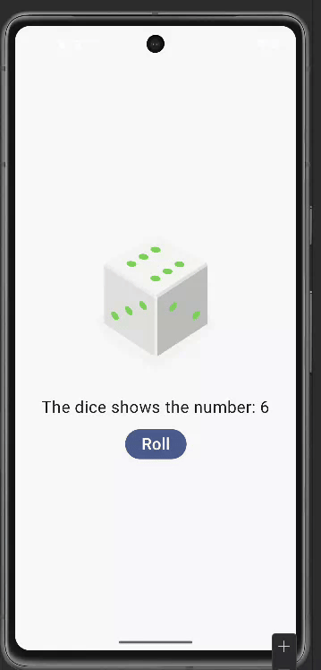

# Create an interactive Dice Roller app

Result:


Modification:

- Changed the dice color to red.
- Added a description for each dice roll outcome.

```kt
@Composable
fun DiceWithButtonAndImage(modifier: Modifier = Modifier) {
    var result by remember { mutableStateOf(1) }
    val imageResource = when(result) {
        1 -> R.drawable.dice_1
        2 -> R.drawable.dice_2
        3 -> R.drawable.dice_3
        4 -> R.drawable.dice_4
        5 -> R.drawable.dice_5
        else -> R.drawable.dice_6
    }

    Column(modifier = modifier, horizontalAlignment = Alignment.CenterHorizontally) {
        Image(painter = painterResource(imageResource), contentDescription = result.toString())

        Spacer(modifier = Modifier.height(16.dp))

        Text(
            text = "The dice shows the number: $result",
            fontSize = 24.sp
        )

        Spacer(modifier = Modifier.height(16.dp))

        Button(
            onClick = { result = (1..6).random() },
        ) {
            Text(text = stringResource(R.string.roll), fontSize = 24.sp)
        }
    }
}
```

