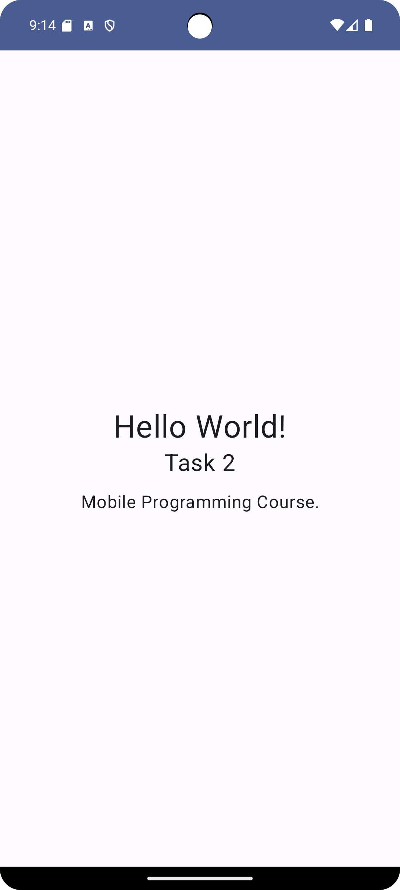

# Jetpack Compose Basics

Modification `MainActivity.kt`:

```kt
package com.example.basiclayouts

import android.os.Bundle
import androidx.activity.ComponentActivity
import androidx.activity.compose.setContent
import androidx.compose.foundation.layout.Arrangement
import androidx.compose.foundation.layout.Column
import androidx.compose.foundation.layout.fillMaxSize
import androidx.compose.foundation.layout.padding
import androidx.compose.foundation.layout.size
import androidx.compose.material3.MaterialTheme
import androidx.compose.material3.Surface
import androidx.compose.material3.Text
import androidx.compose.runtime.Composable
import androidx.compose.ui.Alignment
import androidx.compose.ui.Modifier
import androidx.compose.ui.text.font.Font
import androidx.compose.ui.text.style.TextAlign
import androidx.compose.ui.tooling.preview.Preview
import androidx.compose.ui.unit.dp
import androidx.compose.ui.unit.sp
import com.example.basiclayouts.ui.theme.BasicLayoutsTheme

class MainActivity : ComponentActivity() {
    override fun onCreate(savedInstanceState: Bundle?) {
        super.onCreate(savedInstanceState)
        setContent {
            BasicLayoutsTheme {
                // A surface container using the 'background' color from the theme
                Surface(
                    modifier = Modifier.fillMaxSize(),
                    color = MaterialTheme.colorScheme.background
                ) {
                    Greeting("World")
                }
            }
        }
    }
}

@Composable
fun Greeting(name: String, modifier: Modifier = Modifier) {
    Column(
        verticalArrangement = Arrangement.Center,
        horizontalAlignment = Alignment.CenterHorizontally,
        modifier = modifier.fillMaxSize()
    ) {
        Text(
            text = "Hello $name!",
            fontSize = 32.sp,
            modifier = modifier
        )

        Text(
            text = "Task 2",
            fontSize = 24.sp,
            modifier = Modifier.padding(bottom=12.dp)
        )

        Text(
            text = "Mobile Programming Course.",
            fontSize = 18.sp,
            textAlign = TextAlign.Center,
            modifier = Modifier.padding(start = 18.dp, end = 18.dp)
        )

    }

}

@Preview(showBackground = true, showSystemUi = true)
@Composable
fun GreetingPreview() {
    BasicLayoutsTheme {
        Greeting("Daniel")
    }
}
```

Result:


