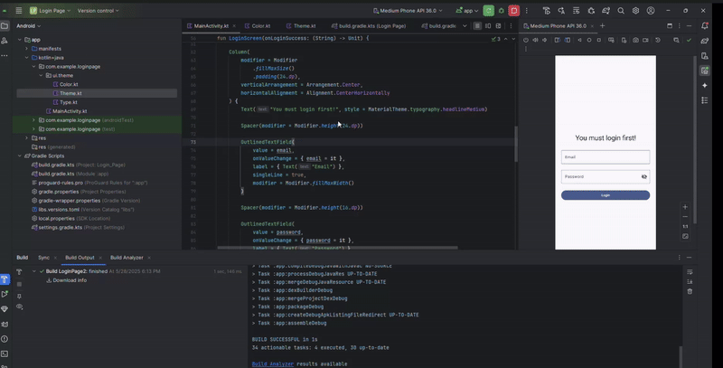

# Create Simple Login Page

> A simple login app built with Jetpack Compose that demonstrates basic authentication flow. The app consists of two main screens: a login screen where users enter their email and password (with password visibility toggle), and a home screen that welcomes the logged-in user.

- Modification:

```kt
package com.example.loginpage

import android.os.Bundle
import android.widget.Toast
import androidx.activity.ComponentActivity
import androidx.activity.compose.setContent
import androidx.compose.foundation.layout.*
import androidx.compose.material.icons.Icons
import androidx.compose.material.icons.filled.Visibility
import androidx.compose.material.icons.filled.VisibilityOff
import androidx.compose.material3.*
import androidx.compose.runtime.*
import androidx.compose.ui.Alignment
import androidx.compose.ui.Modifier
import androidx.compose.ui.graphics.Color
import androidx.compose.ui.platform.LocalContext
import androidx.compose.ui.text.input.*
import androidx.compose.ui.unit.dp
import com.example.loginpage.ui.theme.LoginPageTheme

class MainActivity : ComponentActivity() {
    override fun onCreate(savedInstanceState: Bundle?) {
        super.onCreate(savedInstanceState)
        setContent {
            LoginPageTheme {
                Surface(
                    modifier = Modifier.fillMaxSize(),
                    color = MaterialTheme.colorScheme.background
                ) {
                    var isLoggedIn by remember { mutableStateOf(false) }
                    var userEmail by remember { mutableStateOf("") }

                    if (isLoggedIn) {
                        HomeScreen(
                            email = userEmail,
                            onLogout = {
                                isLoggedIn = false
                                userEmail = ""
                            }
                        )
                    } else {
                        LoginScreen(
                            onLoginSuccess = { email ->
                                userEmail = email
                                isLoggedIn = true
                            }
                        )
                    }
                }
            }
        }
    }
}

@Composable
fun LoginScreen(onLoginSuccess: (String) -> Unit) {
    val context = LocalContext.current
    var email by remember { mutableStateOf("") }
    var password by remember { mutableStateOf("") }
    var passwordVisible by remember { mutableStateOf(false) }

    Column(
        modifier = Modifier
            .fillMaxSize()
            .padding(24.dp),
        verticalArrangement = Arrangement.Center,
        horizontalAlignment = Alignment.CenterHorizontally
    ) {
        Text("You must login first!", style = MaterialTheme.typography.headlineMedium)

        Spacer(modifier = Modifier.height(24.dp))

        OutlinedTextField(
            value = email,
            onValueChange = { email = it },
            label = { Text("Email") },
            singleLine = true,
            modifier = Modifier.fillMaxWidth()
        )

        Spacer(modifier = Modifier.height(16.dp))

        OutlinedTextField(
            value = password,
            onValueChange = { password = it },
            label = { Text("Password") },
            singleLine = true,
            modifier = Modifier.fillMaxWidth(),
            visualTransformation = if (passwordVisible) VisualTransformation.None else PasswordVisualTransformation(),
            trailingIcon = {
                val icon = if (passwordVisible) Icons.Filled.Visibility else Icons.Filled.VisibilityOff
                IconButton(onClick = { passwordVisible = !passwordVisible }) {
                    Icon(imageVector = icon, contentDescription = null)
                }
            }
        )

        Spacer(modifier = Modifier.height(24.dp))

        Button(
            onClick = {
                if (email.isBlank() || password.isBlank()) {
                    Toast.makeText(context, "Email dan password tidak boleh kosong!", Toast.LENGTH_SHORT).show()
                } else {
                    onLoginSuccess(email)
                }
            },
            modifier = Modifier.fillMaxWidth(),
            colors = ButtonDefaults.buttonColors(
                containerColor = MaterialTheme.colorScheme.primary,
                contentColor = MaterialTheme.colorScheme.onPrimary
            )
        ) {
            Text("Login")
        }
    }
}

@Composable
fun HomeScreen(email: String, onLogout: () -> Unit) {
    Column(
        modifier = Modifier
            .fillMaxSize()
            .padding(24.dp),
        verticalArrangement = Arrangement.Center,
        horizontalAlignment = Alignment.CenterHorizontally
    ) {
        Text("Welcome Back, $email!", style = MaterialTheme.typography.headlineMedium)

        Spacer(modifier = Modifier.height(32.dp))

        Button(
            onClick = onLogout,
            colors = ButtonDefaults.buttonColors(
                containerColor = Color.Red,
                contentColor = Color.White
            )
        ) {
            Text("Logout")
        }
    }
}
```

Final Result:

