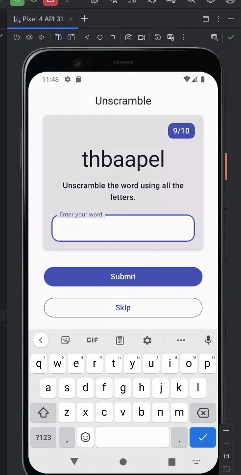

# Unscramble App: ViewModel and State

Single player game app that displays scrambled words. To play the game, player has to make a word using all the letters in the displayed scrambled word. This code demonstrates the Android Architecture component- ViewModel and StateFlow. [Source Code](https://github.com/google-developer-training/basic-android-kotlin-compose-training-unscramble/tree/starter)

## Result

